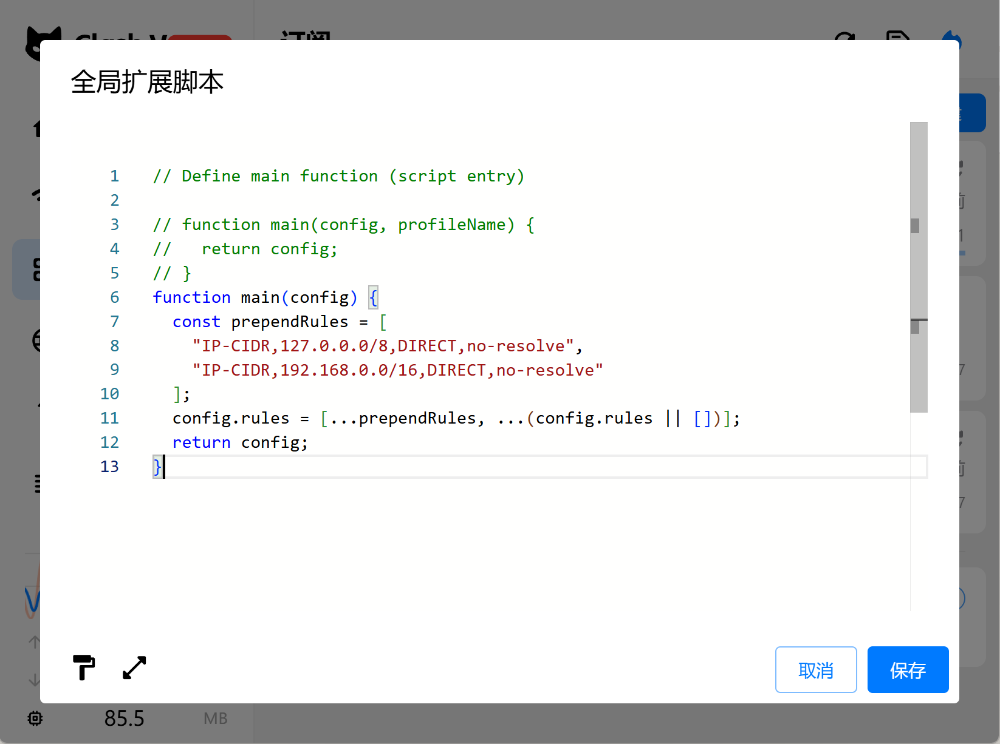

# claudecode-hub

A self-hosted proxy that lets multiple Claude Code terminals share a pool of Anthropic accounts, with automatic rate-limit-aware routing and a web-based admin dashboard.

## Quick Start

**Prerequisites:** Node.js 18+, running on Linux / macOS / WSL

<details>
<summary>Install Node.js (if not already installed)</summary>

```bash
# Using nvm (recommended)
curl -o- https://raw.githubusercontent.com/nvm-sh/nvm/v0.40.3/install.sh | bash
source ~/.bashrc
nvm install --lts
```

</details>

```bash
git clone https://github.com/Xavier1999-Chen/claudecode-hub.git
cd claudecode-hub
bash install.sh
bash start.sh
```

Then open the admin UI at **http://127.0.0.1:3182** and:

1. Click **添加账号** to log in with your Anthropic account via OAuth
2. Go to the **终端** tab and click **新建** to create a terminal — you'll get an API key (`sk-hub-...`)
3. Point Claude Code at the proxy:

```bash
export ANTHROPIC_BASE_URL=http://127.0.0.1:3180
export ANTHROPIC_API_KEY=sk-hub-...   # the key from step 2
claude
```

## Ports

| Service | Default port | Override |
|---------|-------------|---------|
| Proxy   | 3180        | `PROXY_PORT` env var |
| Admin   | 3182        | `ADMIN_PORT` env var |

## FAQ

### Claude Code can't reach the proxy — how do I set `ANTHROPIC_BASE_URL`?

**Same machine as the proxy:**

```bash
export ANTHROPIC_BASE_URL=http://127.0.0.1:3180
```

**Another machine on the LAN:**

Replace `127.0.0.1` with the proxy server's LAN IP (e.g. `192.168.110.181`):

```bash
export ANTHROPIC_BASE_URL=http://192.168.110.181:3180
```

Run `ip addr` or `hostname -I` on the server if you're unsure of its IP.

---

### WSL2 + Clash: proxy receives no requests, Claude Code throws `UND_ERR_SOCKET`

**Symptom:** Claude Code fails with `UND_ERR_SOCKET`, the proxy prints no logs at all, but switching to a different subscription fixes it.

**Cause:** WSL2 inherits Windows's `http_proxy=http://127.0.0.1:7890`, so all outbound requests from Claude Code — including those to `127.0.0.1:3180` — go through Clash. Clash Verge's "proxy bypass" setting only applies to Windows apps, not WSL2. Node.js/undici also does not support wildcard patterns like `127.*` in `no_proxy`.

If the active subscription has no DIRECT rule for local IPs, Clash forwards the request to the remote proxy server, which cannot reach back to your machine — so the proxy never sees the request.

**Fix:** Use Clash Verge Rev's global extension script to prepend DIRECT rules for all subscriptions. This persists across subscription refreshes.

In the subscription list, scroll to the bottom → click the **全局扩展脚本（Script）** card → paste the following and save:

```javascript
function main(config) {
  const prependRules = [
    "IP-CIDR,127.0.0.0/8,DIRECT,no-resolve",
    "IP-CIDR,192.168.0.0/16,DIRECT,no-resolve",
    "IP-CIDR,10.0.0.0/8,DIRECT,no-resolve",
    "IP-CIDR,172.16.0.0/12,DIRECT,no-resolve"
  ];
  config.rules = [...prependRules, ...(config.rules || [])];
  return config;
}
```



After saving, click **使用** to re-apply the active subscription. The IP-CIDR DIRECT rules should appear at the top of Clash's rules list.

The three ranges above cover all standard private address spaces (RFC 1918). If your proxy server's LAN IP falls outside these ranges, add a matching `IP-CIDR` rule for it as well.

---

## Project structure

```
src/
  proxy/      # API proxy server (forwards requests to Anthropic)
  admin/      # Admin server + React dashboard
  shared/     # Config store, name generator
config/       # Runtime data (gitignored: accounts.json, terminals.json)
logs/         # Usage logs per account (gitignored)
```
